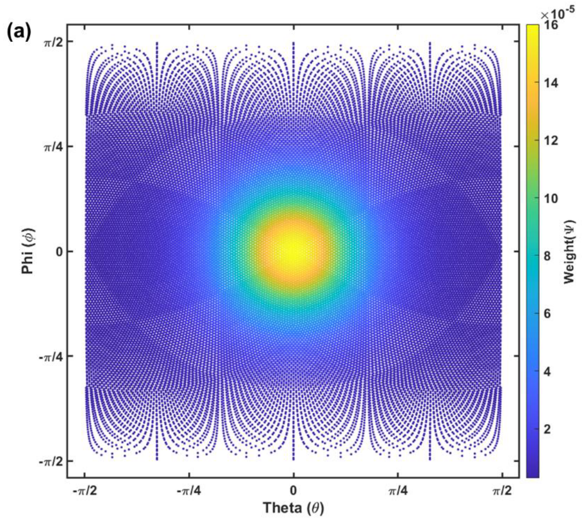

# Orientation Distribution Tensor 부분 정리
## <a href="zotero://open-pdf/library/items/II3D7BDP?page=74&#x26;annotation=8FDWQN5Z">“Chapter 3. Machine learning-assisted two-step homogenization of SFRP using pseudograin approach”</a>
***
## Research background
*   SFRP의 injection molding simulation은 local microstructure를 numerical cost 문제로 orientation tensor만을 제공함
*   따라서 ODF를 재구축하는 것이 필수적이며, 대표적으로 maximum entropy를 쓸 수 있음
*   그러나 ME method는 iterative minimization problem을 요구하며, cost가 커서 대규모 시뮬레이션에 부적합.
*   이에 인공신경망을 이용한 보조를 제안
### Research scheme
1.  10000개의 임의방향 텐서를 생성
2.  ME로 ODF 재구축
3.  K means clustering으로 재구성된 ODF 유사결정립 분해
4.  orientation tensor, 재구축된 ODF, 유사결정립 분해 데이터로 여러 개의 ANN을 구성하고 훈련
***
## Methods
### Fiber ODF and tensor
fiber orienation 의 unit vector p는 아래와 같이 표현 가능함(θ및 φ는 모두 -π/2,+π/2 로 제한됨) $p=(\mathrm{~cos}\theta\mathrm{cos}\phi,\mathrm{~sin}\theta\mathrm{cos}\phi,\mathrm{~sin}\phi)$. (p)는 아래의 특성을 가짐
*   ψ(p) 값은 p 방향에서 fiber를 얻을 ‘확률’과 대응되는 개념임.
*   따라서 전체 domain 상에서 적분을 하면 확률이기 떄문에 1이 됨.
    *    $\int_{\Omega}\psi(p)dp=1$.
    *   단섬유 사출재에서 ODF 정보를 얻기 위해서 fluctuating macroscopic variable에 대한 distribution function의 변화를 나타내는 Fokker-Plank 방정식을 풀게 됨.
    *   Fokker-Plank equation :$\frac{\partial\psi}{\partial t}=-\nabla\cdot(\dot{\mathbf{p}}\psi)+D_r\nabla^2\psi$ .(D는 실험적으로 얻어지는 fiber interaction coeff.)
*   그러나 위의 equation을 3차원 사출에 대해 푸는 것은 상당히 비용 소모가 큼.따라서 대신에 몰드엑스같은 상용 사출재 해석 프로그램은 fiber orientation model을 사용함
*   즉, 위의 Fokker-Plank 대신, Folgar-Tucker equation (manufacturing 공정 상에서 second order fiber orientation tensor $a_{ij}$변화 설명)[을]()채택함.
    *   $\frac{\partial a_{ij}}{\partial t}=-\frac{1}{2}\Big(\omega_{ik}a_{kj}-a_{ik}\omega_{kj}\Big)+\frac{\lambda}{2}\Big(\dot{\gamma}_{ik}a_{kj}+a_{ik}\dot{\gamma}_{kj}-2a_{ijkl}\dot{\gamma}_{kl}\Big)+2D_{r}\Big(\delta_{ij}-3a_{ij}\Big)$
    *   $\omega_{ij}$ : vorticity tensor
    *   $\dot\gamma_{ij}$ : deformation rate tensor
    *   $a_{ijkl}$ : fourth-order fiber orientation tensor
    *   이 때 위의 second, fourth-order orientation tensor는 ODF로부터 얻을 수 있음.
### ODF와 Orientation tensor
*   orientation tensor는 주로 2차 또는 4차 텐서로 표현되며, 섬유의 **평균적인 방향성**을 나타냄
*    섬유의 방향성을 통계적으로 요약한 값으로, 특정 방향으로의 정렬 정도를 나타내게 됨. 이에 따라 섬유의 분포에 대한 세부 정보를 제공하지 않으며, 복잡한 방향 분포를 정확히 표현하기 어려움.
*   한편 ODF는 섬유가 공간 내에서 어떻게 분포되어 있는지를 나타내는 함수
*   섬유의 방향성을 보다 상세하게 나타내며, 각 방향에서의 섬유의 확률 밀도를 제공
***
### ODF 재구축
*   Orientation tensor는 평균적인 방향성을 나타내게 되므로, 두 개의 완전히 다른 ODF가 동일한 orientation tensor를 가질 수 있음. 즉, orientation tensor로부터 ODF를 재구축하는건 해가 무수히 많은 문제를 푸는 것임.
*   이를 해결하기 위한 모델이 maximum entropy 방법으로, 사출성형된 단섬유 복합재 미세구조가 최대 엔트로피를 가지는 경향이 있다는 경험적 관찰을 기반으로 개발됨.
*   우리 연구에서는 단위 sphere 위에서 이변량 빙엄 분포(bivariate Bingham distribution)를 사용하여 최대 엔트로피를 가진 ODF를 결정하기 위한 Breuer et al. \[132]의 해석을 채택
#### ME 재구성
3차원 카테시안 좌표계 상에서 무수히 많은 벡터가 존재할 수 있으므로, 이를 모두 고려해서 entropy를 계산하기 보다는 icosphere 개념을 도입하여 일정한 간격으로 모든 방향을 나타내는 단위 방향 벡터들을 도입하고, 이를 이용해서 엔트로피 개념을 도입함.\

*   먼저 단위 sphere를 여러 개의 동등한 삼각형 메쉬로 분할함. (icoshere 개념)
    *   0차 icosphere는 20개의 동등한 삼각형 메쉬로 구성된 정규 icosahedron
    *   각 삼각형의 중심 좌표가 방향 단위 벡터임
    *   n+1차 icosphere는 n차에서의 삼각형 메쉬를 4개의 더 작은 삼각형으로 분할
*   이 때 icosphere 상의 k번째 삼각 메쉬에서의 단위 방향 벡터를 $\mathbb{P}_{k}=\left(\begin{array}{c}{P_{1k},P_{2k},P_{3k}}\end{array}\right)$로 정의함.
*   이에 따라 해당 단위방향벡터에서의 ODF 도 2변수 빙엄 분포로 정의 가능함.
    *   $\psi(\mathbb{P}_k)=Ce^{-\alpha P_{3k}^2+\beta P_{1k}^2}$
    *   이 때 α와 β가 빙엄 분포에서의 파라미터이며, C는 normalization constant (확률 정의에 따라 적분 시 전체 합이 1이 되도록)
*   그리고 orientation tensor와 entropy도 아래와 같이 정의 가능
    *   $a_{ij}=\sum_kP_{ik}P_{jk}\psi(\mathbb{P}_k)$ .
    *   $S=-\sum_k\psi(\mathbb{P}_k)\ln(\psi(\mathbb{P}_k))$ .
    *   이를 ME 방법에선 minimization procedure를 통해 S를 최대화하는 α와 β를 찾게 되며, 아래 두 objective function을 동시에 최소화하는 문제가 됨
        *   $f_{1}(\alpha,\beta)\:=\:\sum_{ij}\left(\frac{a_{ij}^{given}-a_{ij}(\:\alpha,\beta)}{a_{ij}^{given}}\right)^2$ .
            *   α, β로 계산된 orientation tensor가 target orientation tensor와 같아야 함.
        *     $f_{2}(\:\alpha,\beta)\:=\left(\frac{S_{max}^{global}-S(\:\alpha,\beta)}{S_{max}^{global}}\right)^{2}$.
            *   orientation tensor 가 1/3,1/3,1/3일 때인 global maximum entropy에 최대한 가깝도록.
### 유사결정립 분해
위의 과정을 따라 재구성 절차가 완료되면, ODF는 단방향으로 정렬된 짧은 섬유로 이루어진 여러 개의 유사결정립으로 분해가 필요함. 여기에 K-means clustering을 사용함. (공간 상에서 유사한 위치에 있는 것들 끼리 k개의 묶음으로 만드는 기계학습 방법)
***
## Results and Discussion
### ODF 재구축
*   4차 icosphere가 사용되어 총 5120개의 triangular mesh가 사용되었고, 대칭성을 고려해서 전체 삼각 메쉬의 절반만 사용함.
*   orientation tensor의 경우 좌표변환을 통해 off diagonal 성분을 없앨 수 있으므로 대각성분만을 고려함.여기선 예시인지는 잘 모르겠는데, orientation tensor를 \[0.7,0.15,0.15]로 두고 α와 β를 찾음. 범위 내 랜덤한 α, β에서 시작해 Pareto optimization 결과 아래와 같은 결과여기서 orientation tensor에 대한 최적화 함수인 objective function1을 최소화하는게 더 중요하므로(재구축 ODF로 부터 원래 시작 orientation tensor는 정확하게 나와야 함), 좌상단에 있는 값을 사용함.해당 orientation tensor로부터 얻어진 α, β로 만든 ODF. 평균 방향인 0.7,0.15,0.15를 고려했을 때 1축방향으로 분포가 높은 것을 확인할 수 있고, y,z 평면 상에서 대칭을 이룸을 확인할 수 있다.
### 유사결정립 분해
*   여기선 6차 icosphere를 사용하여,  81920 삼각 메쉬가 사용됨. 이 때 대칭성을 고려해 절반만 사용함
*   각 mesh에서 방향단위벡터가 있으므로 총 40960개의 방향이 존재함.  이 떄 한 ODF에 대해서 각 방향별로 분포에 대한 weight가 존재할 것.$\mathbb{X}=\begin{pmatrix}\mathbb{P}_1,\mathbb{P}_2,&\cdots,\mathbb{P}_{40960}\end{pmatrix}$ .$\mathbb{W}=\begin{pmatrix}\psi(\mathbb{P}_1),\psi(\mathbb{P}_2),\cdots,\psi(\mathbb{P}_{40960})\end{pmatrix}$.
*   만약 위의 0.7, 0.15, 0.15 케이스에서 각 방향에 대한 weight를 카테시안이 아닌 θ φ 공간 상에서 나타내면 아래와 같음.
*   k means clustering은 대칭성을 고려해 1사분면 내에서만 이루어지며, 각 data point간 유클리드 거리를 고려하여 할당됨.
*   각 cluster에서의 ODF의 합은 유사결정립의 volume fraction이 되며, centroid 값이 해당 유사결정립의 대표 orientation이 됨.$\begin{array}{cccc}\hline\textbf{Pseudograin}&\textbf{Equivalent orientation}&\textbf{Volume fraction}\\\hline\text{PG1}&(0.24,0.19)&58.36&\%\\\hline\\\text{PG2}&(0.29,0.65)&22.96&\%\\\hline\\\text{PG3}&(0.93,0.40)&18.68&\%\\\hline\end{array}$.
  
### 인공신경망 구축
test